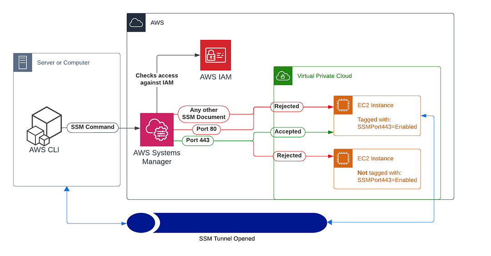

# AWS SSM Port Forwarding Blog

## Overview

This code was uploaded to sit alongside the blog post I wrote around AWS SSM Port Forwarding and how to harden it.

This codebase showcases a way to lock down AWS SSM port forwarding in a secure, scalable manner that you do not get out of the box.

This repo contains 2 different streams for controlling access; defining seperate IAM policies and SSM documents for each port, or compiling a list of whitelisted ports into one IAM Policy and SSM Document. Your specific use-case will decide if you want to use one, the other, or both.

### High Level Solution Overview

## Files and Folders

There are various files, and you may not need all of them. The sections below outline the files.

### Terraform Files

In the [terraform/](terraform/) folder.

|Terraform File|Description|
|---|---|
|iam-instance-policy.yml|Defines a policy that can be attached to instances to allow them enough access for their SSM Agent to connect to the AWS SSM service|
|iam-policy-specific-ports.tf|Defines a set of IAM policies that can restric entities to only exposing an individual port on a target|
|iam-policy-whitelisted.tf|Defines an IAM policy that can restrict entities to only expose whitelisted ports on a target|
|iam-role.tf|Defines an IAM role that can be used to access SSM using the policies defined above|
|locals.tf|Defines Terraform local variables that are used for the dynamic terraform code|
|ssm-document-specific-ports.tf|Defines SSM Documents to expose specific ports|
|ssm-document-whitelisted-ports.tf|Defines an SSM Document to allow the caller to expose a set of whitelisted ports|

### AWS Documents

In the [aws-documents/](aws-documents/) folder.

The aws-documents folder contains the JSON documents created in AWS as part of this terraform.
Here is how each one relates to a terraform file above (see the terraform section for more details around these files)

|AWS JSON Document|Corresponding Terraform File|
|---|---|
|iam-policy-SSMPortForward443Policy.json|iam-policy-specific-ports.tf|
|iam-policy-SSMPortForward80Policy.json|iam-policy-specific-ports.tf|
|iam-policy-SSMPortForwardWhitelistedPolicy.json|iam-policy-whitelisted.tf|
|iam-role-SSMPipelineRole.json|iam-role.tf|
|ssm-document-ForwardPort443.json|ssm-document-specific-ports.tf|
|ssm-document-ForwardPort80.json|ssm-document-specific-ports.tf|
|ssm-document-ForwardWhitelistedPorts.json|ssm-document-whitelisted-ports.tf|

### Docs

In the [docs/](docs/) folder.

You can ignore the docs folder as it just contains content that is referenced in this README.

### Scripts

In the [scripts/](scripts/) folder.

# TODO

